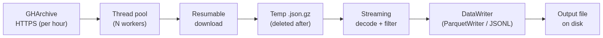

# gharc: GitHub Archive Stream-Processor

[](https://pypi.org/project/gharc/)
[](https://opensource.org/licenses/MIT)
[](https://github.com/aravpanwar/gharc/actions)
[](https://www.python.org/downloads/)
[](https://github.com/psf/black)
[](https://doi.org/10.5281/zenodo.19814232)

**Pull filtered slices of the GitHub Archive on a laptop, without holding raw hours on disk.**

`gharc` is a command-line tool and Python library that filters the [GitHub Archive](https://www.gharchive.org/) dataset on consumer hardware. Each hourly archive is streamed through memory, filtered against your criteria, and written out as Parquet or JSONL. Peak local storage stays bounded by the downloads in flight at once, one temporary file per worker (each hourly archive is roughly 60 to 150 MB in 2024), so disk use scales with `--workers` rather than with how long a window you process.

---

## Why gharc?

The full GitHub Archive spans every public event since 2011: tens of terabytes compressed, and several petabytes uncompressed. Most studies need only a small slice of it, but the archive has no server-side filtering, so the usual options are downloading whole hours to local disk or querying a cloud-warehouse mirror (BigQuery, Snowflake).

`gharc` takes a third route and filters during the download:
1.  **Streaming:** Downloads each hourly archive (~60 to 150 MB compressed in 2024) to a temporary file.
2.  **Filtering:** Keeps only the events matching your filters (repositories, owners, actors, event types).
3.  **Writing:** Appends the matches to a single **Parquet** or **JSONL** output via `pyarrow.ParquetWriter`.
4.  **Cleanup:** Deletes the temporary download before moving to the next hour, so disk usage never accumulates.

It is meant for researchers and students who need event-level GitHub data over long windows but do not have a warehouse account or the disk to hold raw months.



---

## Key Features

* **Bounded disk:** Peak local storage is the downloads in flight, one temporary file per worker (about 250 MB at the default 4 workers, about 85 MB with a single worker), and it does not grow with the length of the window. For selective filters the working memory stays near 100 MB; a very wide or empty filter buffers more of each hour and uses more.
* **Resumable downloads:** Recovers from network interruptions (common on residential connections) using HTTP Range requests.
* **Parallel processing:** Hours in the range are downloaded and filtered across a thread pool.
* **Filtering before parsing:** A byte-level token check rejects lines that cannot match before any JSON parsing. With a selective filter most lines never reach the parser; a wide or empty filter gains nothing from this.
* **Optional orjson:** Uses `orjson` for JSON parsing when it is installed, which is faster than the standard library parser.
* **Parquet output:** Writes columnar data that loads directly into pandas, Polars, or Spark. JSONL output is available for resumable runs and line-oriented tools.

---

## Performance

Measured on a Windows 11 laptop (12 logical cores, 15 GB RAM) over a typical residential connection. Reproducible scripts in [`benchmarks/`](benchmarks/).

A six-hour window of GHArchive (2024-01-01 00:00 to 06:00 UTC), filtered to `apache/spark`:

| Workers | Wall-clock | Hours/sec | Spark events | Peak RSS |
|---|---|---|---|---|
| 1 | 76.0 s | 0.079 | 14 | 94.2 MB |
| 4 | 58.1 s | 0.103 | 14 | 106.7 MB |

Both runs recovered the same events, so concurrency does not affect output. Peak RSS stays below 110 MB. The bottleneck on residential links is HTTPS download throughput rather than CPU; additional workers help up to a point and then saturate the connection.

Across the same six-hour window gharc streams about 416 MB of compressed source from GHArchive (six hourly files of roughly 60 to 85 MB each) but never retains it. The full source is still transferred, so this is not a bandwidth saving; what stays bounded is local disk. Peak disk is held to the temporary files in flight, one per worker: about 85 MB with a single worker and about 250 MB at the default four workers. The filtered Parquet output for `apache/spark` over that window is 53 KB, and local disk does not grow with the length of the window processed.

---

## Installation

### Prerequisites
- Python 3.10 or higher
- `pip`

### Install from PyPI

```bash
pip install gharc
```

### Install from Source

```bash
git clone https://github.com/aravpanwar/gharc.git
cd gharc
python -m venv venv
# macOS / Linux:
source venv/bin/activate
# Windows PowerShell:
#   .\venv\Scripts\Activate.ps1
pip install -e .
```

### Optional: faster JSON parsing

`gharc` uses `orjson` instead of the standard library parser when it is installed. The `fast` extra pulls it in:

```bash
pip install "gharc[fast]"
```

---

## Usage

### Basic Command

Download all activity for a specific repository over a one-day window.
Note that `--end` is exclusive, so this covers all 24 hours of 2024-01-01.

```bash
gharc download \
    --start 2024-01-01 \
    --end 2024-01-02 \
    --repos "apache/spark" \
    --output spark_data.parquet

```

For multi-hour or multi-day runs, prefer `--output run.jsonl` so the run can resume from where it left off if it crashes; convert to Parquet at the end with `gharc convert run.jsonl run.parquet`. See [Resumable runs](#resumable-runs) below for details.

### Advanced Filtering

Filter for multiple repositories and specific event types (e.g., only Pull Requests and Pushes).
This covers all of June 2023 (June 1 inclusive through July 1 exclusive).

```bash
gharc download \
    --start 2023-06-01 \
    --end 2023-07-01 \
    --repos "apache/spark, pandas-dev/pandas, pytorch/pytorch" \
    --event-types "PullRequestEvent, PushEvent" \
    --output oss_summer_2023.parquet \
    --workers 4

```

### Arguments

| Argument | Description | Example |
| --- | --- | --- |
| `--start` | Start date in UTC, inclusive (YYYY-MM-DD or YYYY-MM-DD-HH) | `2024-01-01` |
| `--end` | End date in UTC, exclusive (YYYY-MM-DD or YYYY-MM-DD-HH) | `2024-02-01` |
| `--repos` | Comma-separated repositories to keep; supports `owner/*` wildcards | `apache/spark,apache/*` |
| `--orgs` | Comma-separated repository owners to keep | `apache,pandas-dev` |
| `--actors` | Comma-separated actor logins to keep | `dongjoon-hyun,cloud-fan` |
| `--event-types` | Comma-separated list of GHArchive event types | `WatchEvent,ForkEvent` |
| `--output` | Output filename (`.parquet` or `.jsonl`) | `data.parquet` |
| `--workers` | Number of parallel download threads (default: 4) | `8` |

Dates are interpreted as UTC, matching GHArchive's hourly file naming.

Repository names are matched exactly and are case-sensitive, so pass the canonical `owner/name` as it appears on GitHub (for example `apache/spark`). Use `apache/*` or `--orgs apache` to keep every repository under an owner. `--repos` and `--orgs` are combined (an event is kept if it matches either), while `--event-types` and `--actors` further narrow the result.

---

## Resumable runs

For long jobs, `gharc` keeps a small `<output>.state.json` next to the output file listing which hours it has already processed. If the run crashes, restarting the same command picks up where it left off rather than redoing completed hours. The state file is written atomically (a temporary file renamed into place) so a crash mid-write cannot corrupt it, and it is removed automatically when the run finishes cleanly. Note that `gharc` relies on the operating system to flush writes to disk rather than forcing an `fsync` after each hour, so an abrupt power loss (as opposed to a process crash) could in rare cases leave an hour marked done whose data had not yet reached disk.

Resume support requires JSONL output. Parquet writers cannot append to a closed file, so for multi-hour runs use `--output run.jsonl` and convert to Parquet at the end:

```bash
gharc convert run.jsonl run.parquet
```

---

## Python API

The CLI is a thin wrapper around `gharc.process_range`, which you can call directly:

```python
from datetime import datetime
import gharc

gharc.setup_logging()
gharc.process_range(
    start=datetime(2024, 1, 1),
    end=datetime(2024, 1, 2),
    repos=["apache/spark"],
    event_types=None,
    output="spark_one_day.jsonl",
    workers=4,
)

gharc.jsonl_to_parquet("spark_one_day.jsonl", "spark_one_day.parquet")
```

`process_range` also accepts `orgs` and `actors` keyword arguments mirroring the `--orgs` and `--actors` CLI flags, and entries in `repos` may use `owner/*` wildcards, so `repos=["apache/*"]` keeps every repository under an owner.

`__all__` in `gharc/__init__.py` lists the public surface (`process_range`, `jsonl_to_parquet`, `DataWriter`, `parse_date`, `date_range`, `get_url_for_time`, `setup_logging`, plus the filter helpers).

---

##  Automating Bulk Downloads

For long date ranges, the included [`examples/orchestrator.py`](examples/orchestrator.py) script runs `gharc` month by month so each year produces one Parquet file per month rather than one giant output:

```bash
python examples/orchestrator.py \
    --start 2023-01-01 \
    --end 2024-01-01 \
    --repos "apache/spark,pandas-dev/pandas" \
    --output-dir ./gharc_out \
    --workers 4
```

---

## Repository Layout

```
gharc/
├── src/gharc/        # Library + CLI entry point
├── tests/            # pytest test suite
├── benchmarks/       # Reproducible runs that back the performance claims
├── examples/         # Driver scripts (e.g. month-by-month orchestrator)
├── paper/            # paper.md, paper.bib, figures (the JOSS submission)
└── CITATION.cff      # GitHub-detectable citation metadata
```

---

## Contributing

Contributions are welcome. Please read [CONTRIBUTING.md](CONTRIBUTING.md) for details on the process for submitting pull requests.

**Running Tests:**

```bash
pip install -e ".[test]"
pytest tests/
```

---

## Citation

The accompanying paper is at [`paper/paper.pdf`](paper/paper.pdf) and is rebuilt automatically on every push by the [Paper CI workflow](.github/workflows/paper.yml).

If you use `gharc` in your research, please cite it using the metadata in `CITATION.cff` or as follows:

```bibtex
@software{gharc2026,
  author = {Panwar, Arav},
  title = {gharc: A stream-and-filter tool for the GitHub Archive on consumer hardware},
  year = {2026},
  url = {https://github.com/aravpanwar/gharc}
}

```

---

## License

This project is licensed under the MIT License - see the [LICENSE](LICENSE) file for details.

Created by Arav Panwar
[aravpanwar.com](https://www.aravpanwar.com)

